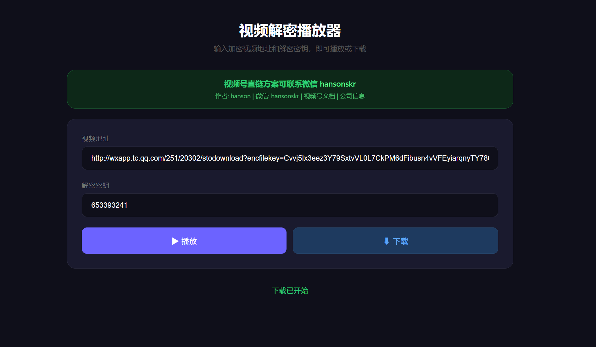

# WechatSphPlayer

微信公众号视频号加密视频解密播放器，输入加密视频地址和解密密钥，即可在线播放或下载解密后的视频文件。

## 功能

- 在线播放加密视频（h264 / HEVC）
- 下载解密后的视频文件
- 自动检测视频编码格式
- VVC/H.266 编码视频自动提示下载（浏览器暂不支持 VVC 播放）
- 流式解密传输，无需下载完整视频

## 使用方式

1. 前往 [Releases](https://github.com/Hanson/weixinSphPlayer/releases) 下载最新版 `Player-windows-amd64.exe`
2. 双击运行，浏览器自动打开播放器页面
3. 输入加密视频地址和解密密钥，点击播放或下载

## 获取加密视频地址和密钥

通过视频号接口获取视频详情，返回的 JSON 中包含 `url`、`urlToken`（拼接为完整播放地址）和 `decodeKey`（解密密钥）。

接口文档详见：https://wechat-finder.apifox.cn

## 联系方式

**视频号直链方案可联系微信：hansonskr**

- 作者：hanson
- 微信：hansonskr
- 视频号文档：https://wechat-finder.apifox.cn
- 公司信息：https://juhebot.com
